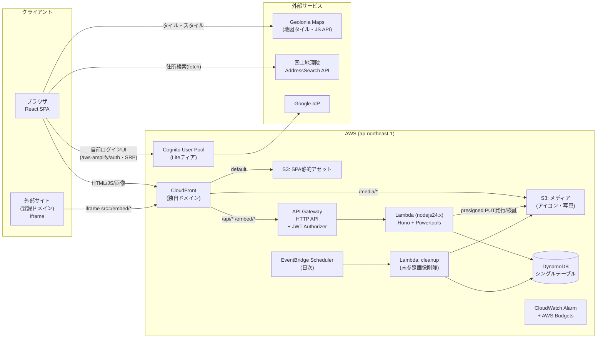

# 技術設計書: OriOriMap（仮称）

- 生成日: 2026-08-11
- 対応要件定義書: docs/spec/01_requirements.md（approved: 2026-08-11）
- 外部調査: docs/spec/\_research.md（初回調査 + 追加調査 2026-08-11）
- ステータス: approved（2026-08-11 承認ゲート②通過。承認条件: CI/CD考慮の追補 → §4.7に反映済み）

## 1. Overview

小規模・低コスト（月額$0〜10目標）・個人運用を最優先し、AWSサーバーレスの無料枠内に収まるフルスタック構成とする。project-patterns.md の P3（フルスタック）= P1（React SPA）+ P2-Node（Hono/Lambda）の既定スタックに準拠し、IaCはSAM（AWS単体完結のため）。embed のドメイン制限は「Lambda が CSP frame-ancestors ヘッダー付きの embed用HTML を直接返す」方式で追加コストゼロで実現する。認証は Cognito User Pool（Liteティア）に委譲し、**パスワードの保存・検証を自前で行わない**（ログインフォームは日本語化とデザイン統一のため自前実装するが、SRP によりパスワード自体はネットワークにも自前バックエンドにも渡らない。§3「認証」行・§4.3）。

## 2. Architecture



補足:

- **単一独自ドメイン（本番: `oriorimap.kiryu.tech`。Cloudflare管理ゾーンからDNS onlyでCNAME）に集約**する。CloudFront のビヘイビアで `default → S3(SPA)` / `/media/* → S3(メディア)` / `/api/*・/embed/* → API Gateway` に振り分ける。同一オリジンになるため CORS 設定が不要になり、Geolonia APIキーのURL登録（完全一致・スキーム込み）も本番1URLで済む。dev環境はCloudFrontデフォルトドメインを使用
- **embed** は `GET /embed/{map|overlay}/{id}` を Lambda が処理し、DynamoDB の許可ドメインから `Content-Security-Policy: frame-ancestors <許可オリジン>` ヘッダーを動的生成した閲覧専用HTMLを返す。CSPヘッダーが必要なのは iframe の src が指す親HTMLのみ（サブリソースには不要。\_research.md §8-2 でMDN確認済み）。このパスはCloudFrontでキャッシュ無効にする
- 重ね合わせの「参照型・自動最新化」（R4.4）は、閲覧時に毎回 `GET /api/maps/:id/geojson` で各元地図の最新データを取得することで実現する（キャッシュしない）

## 3. 技術選定と根拠

| 領域                       | 選定                                                                                                                                                                                           | project-patterns.md既定値との関係                 | 根拠                                                                                                                                                                                                                                                                                     |
| -------------------------- | ---------------------------------------------------------------------------------------------------------------------------------------------------------------------------------------------- | ------------------------------------------------- | ---------------------------------------------------------------------------------------------------------------------------------------------------------------------------------------------------------------------------------------------------------------------------------------- |
| パターン判定               | P3（P1 React + P2-Node）                                                                                                                                                                       | 準拠                                              | UI+API+データモデルあり。地図編集はアプリケーション性が強くReact SPA。フロントと型・Zodスキーマを共有するためP2はNodeサブパターン（最も強いシグナルに合致）                                                                                                                              |
| フロントエンド             | React 18 + TypeScript + Vite + Tailwind CSS v4 + shadcn/ui                                                                                                                                     | 準拠（P1既定）                                    | —                                                                                                                                                                                                                                                                                        |
| フロントホスティング | S3 + CloudFront + GitHub Actions（CI/CD） | **逸脱**（P1既定はAmplify Hosting） | (1) 転送料金: CloudFrontは**常時無料枠1TB/月**に対し、Amplify Hostingは$0.15/GB（無料枠15GB/月・12ヶ月限定）で転送量が伸びた場合に不利 (2) `/api/*`・`/embed/*`をAPI Gatewayへ振り分ける単一ドメイン構成（§2）にはCloudFrontのビヘイビア・キャッシュ制御が必要（AmplifyもCloudFrontベースだが細かなビヘイビア制御に制約） (3) Amplifyの主な利点であるCI/CDは、OSS公開リポジトリのため**GitHub Actions（公開リポは無料）+ SAMデプロイ**で代替できる |
| 地図ライブラリ             | Geolonia JS API（MapLibre GL JS互換）                                                                                                                                                          | カタログ外（要件で確定）                          | ユーザー指示。MapLibre同一シグネチャで `addImage`/Symbolレイヤー/Marker/GeolocateControl が利用可（\_research.md §6-2）                                                                                                                                                                  |
| カスタムアイコン描画       | 閲覧・embed = Symbolレイヤー + `addImage` / 編集UI = HTML Marker のハイブリッド                                                                                                                | カタログ外                                        | 閲覧は将来数千スポットまで実用（DOM Markerは数百件で劣化）。編集は同時数件でドラッグ・ポップアップが1行のMarkerが生産性で勝る（\_research.md §6-1）                                                                                                                                      |
| API                        | API Gateway **HTTP API** + JWT Authorizer + Lambda **nodejs24.x** + Hono（`hono/aws-lambda`）+ Powertools for AWS Lambda (TS) + SAM esbuild(ESM)                                                   | 準拠（P2-Node既定）                               | JWT検証はAPI Gatewayネイティブ機能でLambda Authorizer不要（\_research.md §9-3）。**ランタイムは 2026-08-11 に nodejs22.x から nodejs24.x へ更新**（T002実装時・ユーザー判断）: 22 はサポート期限が2027年4月頃で更新頻度が高い。24 はGA・LTSで**2028年4月**まで、全リージョン提供・Powertools (TS) 対応済み。最新の `nodejs26.x` は **preview** で AWS が本番ワークロード非推奨とし実行ログに警告を出すため不採用（GA後に移行。§10）                                                                                                                                                                                                          |
| DB                         | DynamoDB（シングルテーブル + GSI×2、オンデマンド）                                                                                                                                             | 準拠（P2既定）                                    | 読み取り中心・少量書き込みでアイドル時ゼロ課金。**本サービスのアクセスパターンに空間クエリが存在しない**ことが採用の核（§3.2の比較検討参照）。§6参照                                                                                                                                     |
| 検索・ソート（R3.1, R3.2） | GSI1（公開一覧）を全件Queryし**Lambda内で部分一致フィルタとソート**（`sort=created\|updated` いずれもLambda内。GSIの物理順はupdatedAtのみ）                                                    | 準拠の範囲内                                      | 公開地図は数百件規模の想定でメタデータ全件が1〜数MB・1回のQueryに収まるため、フィルタ・ソートともLambda内で完結させる（created用GSIは追加しない）。この前提は公開コンテンツ合計1,000件までとし、超過時の移行方針を§10に記載。OpenSearch等の検索基盤はコスト（月$25〜）が規模に対して過剰 |
| 認証                       | Cognito User Pool（**Liteティア明示指定**）+ メール/パスワード + Google IdP + **自前ログインUI（`aws-amplify/auth` headless + shadcn/ui。SRP認証）**                                                                           | 準拠（AWSマネージド優先）                         | 無料枠10,000 MAU・パスワード非保持・R1.7のロックアウトも標準機能。パスワードレス等の上位機能は不要でLiteが最大73%安い（\_research.md §9-1）。**2026-08-11 改訂: ログインUIを Hosted UI から自前実装へ変更**（T003実装時に判明した仕様矛盾の解消）。理由: Cognito のログインページ日本語化（`?lang=ja`）は **managed login 限定機能で Essentials 以上が必要**であり、当初の「Liteティア + Hosted UI 日本語化」は AWS 仕様上成立しない。Lite で使えるのは英語の classic hosted UI のみ。AWS の機能プラン表で **Google等のソーシャルIdP・SRP認証・ユーザーグループはいずれも Lite に含まれる**ことを確認済みで、Lite の制約は「Cognitoがホストするログインページ」に限定される。したがって自前UIにすれば制約は解消し、Liteティア（design の低コスト方針）と完全日本語・§5.2 藤重トークンとの一致を両立できる。Essentials への昇格（10,000 MAU まで無料枠は同一で現時点$0）と比較した結果、超過後の単価（Lite $0.0055 / Essentials $0.015）はどちらも予算$10を大幅超過する水準でしか効かず判断材料にならないため、デザイン一貫性とバンドルサイズ（§4性能 LCP≤3秒）で自前UIを採る |
| 認証メール                 | 開発: Cognito既定（50通/日上限）→ 本番: SES連携（`DEVELOPER`構成）                                                                                                                             | 準拠                                              | Cognito既定の50通/日は本番で不足しうる。SES本番アクセス申請はリリース前タスク（§10）                                                                                                                                                                                                     |
| ジオコーディング           | 国土地理院 AddressSearch API（一次）+ Geolonia Community Geocoder（フォールバック）                                                                                                            | カタログ外                                        | 両方無償・商用可・フロントから直接呼べる。GSIはCORS許可済み・街区/号レベル解決が多く精度優位（\_research.md §7）。出典表示をフッターに記載                                                                                                                                               |
| メディア配信               | S3 + CloudFront（`/media/*`）                                                                                                                                                                  | 準拠                                              | —                                                                                                                                                                                                                                                                                        |
| 画像処理                   | アップロード前に**クライアント側Canvasで変換**（アイコン: 最大128px PNG / 写真: 最大1600px JPEG）→ presigned PUT。サーバー側でmagic bytes検証                                                  | 逸脱（サーバー側処理が一般的）                    | Lambdaにsharp等のネイティブバイナリ層を持ち込まず構成を最小化。1MB上限もクライアント変換でほぼ常に満たされる                                                                                                                                                                             |
| インポート解析             | クライアント側パース（KMZ: fflateでZIP展開し `doc.kml`（無ければ最初の`.kml`エントリ）を抽出 / KML: @tmcw/togeojson / CSV: papaparse）→ 一括登録API `POST /api/maps/:id/spots/bulk`（Zod検証） | 逸脱（サーバー側解析が一般的）                    | 行番号付きエラー表示（R7.4）がブラウザ内で完結し、Lambdaのペイロード・実行時間制約も回避。サーバーは最終検証のみ担う。KMZ内の添付画像・ポイント以外の図形は取り込まずスキップ件数として報告（R7.3）                                                                                      |
| バッチ                     | EventBridge Scheduler（日次）→ cleanup Lambda                                                                                                                                                  | 準拠                                              | R2.11（未参照画像の7日以内削除）                                                                                                                                                                                                                                                         |
| バックアップ               | DynamoDB PITR（35日）+ S3バージョニング（**メディアバケットのみ**） | 準拠 | 要件の「日次・7世代(仮)」の上位互換（任意時点復元）として確定（§3.1）。バージョニングの目的はユーザーアップロード画像の誤削除・バッチ不具合からの復元（SPAアセットは再ビルド可能なため対象外）。**削除の実現**: アプリからは通常の`DeleteObject`（削除マーカー作成）で即時不可視化し、ライフサイクルルール「非現行バージョン30日で失効 + 孤立削除マーカーの自動整理」で物理削除を自動化。退会・画像回収の物理消去は最大30日遅延する（この間も外部からはアクセス不可） |
| 監視                       | CloudWatch Alarm（Lambda errors・APIGW 5xx）+ AWS Budgets（$8 = 目標の80%で通知）                                                                                                              | 準拠                                              | 要件§4のコスト超過アラート                                                                                                                                                                                                                                                               |
| IaC                        | **SAM**                                                                                                                                                                                        | 準拠（IaC選定原則）                               | インフラがAWS単体で完結するため。Cloudflareは不採用（下記）                                                                                                                                                                                                                              |
| Cloudflare                 | **DNSのみ利用**（CDN/WAF/WorkersはMVP不採用） | ユーザー指示（AWS・Cloudflare中心）の範囲内で判断 | **ドメインは既存のCloudflare管理ゾーン `kiryu.tech` 配下の `oriorimap.kiryu.tech` を本番ドメインとする（2026-08-11 ユーザー決定）**。レコードは**DNS onlyモード（プロキシOFF）**でCloudFrontへCNAME——プロキシONは二重CDN・ACM/SNIの問題を招くため不可。Route 53への委任移管はしない: 必要レコードはACM検証CNAME（初回のみ・自動更新も同一レコードを継続使用）+本番CNAMEの2〜3件で変更頻度が極小なため、Hosted Zone $0.50/月とNS委任の手間に見合うIaC便益がない（レコード管理が増えたら`oriorimap`サブドメインのNS委任で移行可能）。CDN/WAF/Workersとしての不採用理由: embed制御はLambda直返しで足りる（\_research.md §8-1）。CloudFrontの前段に重ねると二重CDNになる。**転送容量の観点**: 最重量のトラフィックである地図タイルはGeolonia配信であり、自オリジンが配るのはSPAバンドル・GeoJSON・画像のみ（月1万PV想定で〜10GB規模）でCloudFront常時無料枠1TB/月に対し2桁の余裕があり、R2/Pagesのegress無料の優位が実効的に効かない。トラフィック増大時のWorkers移行パスは§10に記録 |
| リポジトリ                 | npm workspaces モノレポ（frontend / backend / infra共通template）                                                                                                                              | 準拠                                              | フロント・バックでZodスキーマ・型を共有                                                                                                                                                                                                                                                  |

### 3.0 DB選定の比較検討（DynamoDB採用の根拠・併用不要の判断）

判断の核: **本サービスのアクセスパターンに空間クエリ（近傍検索・bbox横断検索・空間結合・バッファ演算）が存在しない**。地図の描画・fitBounds・重ね合わせはすべて「地図ID→スポット一式（≤1,000件）」を取得してクライアント側のMapLibreが処理する構造で、DB側に求められるのはKey-Valueアクセスと公開一覧のみ。GIS系サービスでPostGIS等が採用されるのは空間演算をサーバー側で行うためであり、本設計ではその要件自体がスコープ外（経路検索・空間分析はNever/Ask first）。

| 候補 | 空間機能 | 月額目安 | 評価 |
|---|---|---|---|
| **DynamoDB（採用）** | なし（本要件では不要） | $0（無料枠内） | 全アクセスパターン（§6）がKey-Value+GSIで完結。サーバーレスLambdaとの接続管理不要。オンデマンドでアイドル時ゼロ課金 |
| Supabase（PostgreSQL+PostGIS） | ◎ | $0〜25 | 空間演算は最強だが使う場面がない。無料枠はアイドル時の一時停止あり。非AWSベンダー追加+LambdaからのDB接続管理（プーラー）が必要 |
| MongoDB Atlas（2dsphere） | ○ | $0〜 | GeoJSON親和性はあるが優位性が要件に効かない。非AWSベンダー追加・接続管理が必要 |
| OpenSearch（geo_point + 全文検索） | ○ | $25〜 | 全文検索は魅力だが最小構成でも予算（$10）超過。検索は小規模前提のLambda内フィルタで充足（§3の検索行） |
| DuckDB on S3 + spatial拡張 | ◎（分析） | ほぼ$0 | OLAP/バッチ分析向け（P4パターン）。Webアプリの低レイテンシOLTP（随時の行単位書き込み・単一項目読み取り）には不適で、主ストアにならない |
| Aurora Serverless v2 + PostGIS | ◎ | $40〜 | 予算超過。将来空間分析要件が生じた場合の移行先候補 |

併用は不要と判断: 単一のDynamoDBで§6の全アクセスパターンを充足し、追加DBは運用・コスト・バックアップの二重化を招くだけで利点がない。将来「現在地周辺のスポット横断検索」等の空間クエリ要件が生じた時点で、geohash方式のGSI追加またはPostGIS系への移行を検討する（§10）。

### 3.1 要件の「(仮)」数値の確定（承認ゲート②で最終値として提示）

| 要件                          | 仮値         | 確定値                                                                              | 根拠                                         |
| ----------------------------- | ------------ | ----------------------------------------------------------------------------------- | -------------------------------------------- |
| R1.7 ログイン試行制限         | 5回/15分     | **Cognito標準のロックアウト仕様に準拠**（連続失敗で一時ロック・失敗継続で自動延長） | 自前実装せずマネージド機能をそのまま採用     |
| R2.3 アイコン画像             | 1MB          | **1MB / PNG・JPEG・WebP**（クライアント変換後は128px PNG）                          | Symbolレイヤーの`loadImage`対応形式と一致    |
| R2.8 スポット上限             | 1,000件/地図 | **1,000件/地図**                                                                    | GeoJSON応答が概ね数百KBに収まりLCP目標と両立 |
| R2.10 スポット0件時の初期表示 | 日本全体     | **日本全体**（中心: 138.5, 37.0 / zoom 4.5）                                        | —                                            |
| R2.11 未参照画像の回収        | 7日以内      | **7日以内**（日次バッチ）                                                           | —                                            |
| R4.6 重ね合わせ上限           | 10地図       | **10地図**                                                                          | 凡例の識別性とかさね色パレットの色数         |
| R8.3 通報レート               | 10件/時      | **10件/時**（DynamoDBカウンタ+TTL）                                                 | —                                            |
| §4 LCP / API p95              | 3秒 / 500ms  | **3秒 / 500ms**                                                                     | Lighthouse (Slow 4G) / CloudWatchで計測      |
| §4 バックアップ               | 日次・7世代  | **DynamoDB PITR 35日 + S3バージョニング**（上位互換で置換）                         | 任意時点復元が可能になり日次×7世代を包含     |

## 4. コンポーネントとインターフェース

### 4.1 フロントエンド SPA（frontend/）

- 責務: 全画面のUI。地図描画（Geolonia）、ジオコーディング呼び出し、KML/CSVのクライアント側パース、画像のCanvas変換、**認証フロー（自前ログインUI + `aws-amplify/auth`。メール/パスワードは SRP でブラウザから Cognito API へ直接、Googleは `signInWithRedirect` でフェデレーション）**
- 公開I/F: ルーティング `/`（トップ・検索） `/maps/:id`（閲覧・重ね合わせ） `/maps/:id/edit` `/overlays/:id` `/mypage` `/settings` `/admin` ほか
- 入出力: `shared/` のZodスキーマから生成した型でAPIと通信。アクセストークン(JWT)は `Authorization: Bearer` ヘッダーで送付（Cookieは使わない）

### 4.2 APIサービス（backend/ — 単一Lambda・Honoルーティング）

認証: `(公開)` = 認証不要ルート、`(要認証)` = JWT Authorizer、`(admin)` = JWT + Cognitoグループ `admin` をLambda内で検証。

**認可の設計原則**: HTTP APIのJWT Authorizerはルート単位のため、「公開なら誰でも・非公開ならオーナーのみ」を1本のGETに混在させない。**読み取りAPIを公開系（`/api/...`・公開コンテンツのみ返し非公開は404）とオーナー系（`/api/me/...`・JWT必須で自分のものは非公開含め返す）に分離**する。閲覧画面は公開系、編集画面・マイページはオーナー系のみを使う。

| ルート                           | メソッド       | 認証             | 責務（対応要件）                                                                                                                                                                                                 |
| -------------------------------- | -------------- | ---------------- | ---------------------------------------------------------------------------------------------------------------------------------------------------------------------------------------------------------------- |
| `/api/maps`                      | GET            | 公開             | **公開中の**地図・重ね合わせ地図の一覧/検索。`?q=`部分一致・`?sort=created\|updated`（Lambda内フィルタ・ソート。R3.1-3.3）                                                                                       |
| `/api/maps`                      | POST           | 要認証           | 地図作成（R2.1）                                                                                                                                                                                                 |
| `/api/maps/:id`                  | GET            | 公開             | **公開地図のみ**取得（非公開・不存在は404）                                                                                                                                                                      |
| `/api/maps/:id`                  | PUT/DELETE     | 要認証(オーナー) | 更新・削除（R2.4, R2.5。削除はスポット・embed設定を削除し画像参照を`PENDING_DELETE`へ記録）                                                                                                                      |
| `/api/maps/:id/geojson`          | GET            | 公開             | **公開地図のみ**スポットをGeoJSON FeatureCollectionで返す。閲覧・重ね合わせ・embed共用（R4.1, R4.4）                                                                                                             |
| `/api/me/maps`                   | GET            | 要認証           | 自分の地図・重ね合わせ地図の一覧（非公開含む。マイページ用）                                                                                                                                                     |
| `/api/me/maps/:id`               | GET            | 要認証(オーナー) | 自分の地図の取得（非公開含む。編集画面・下書きプレビュー用。GeoJSON含む）                                                                                                                                        |
| `/api/maps/:id/spots`            | POST           | 要認証(オーナー) | スポット追加（R2.2, R2.6, R2.8）                                                                                                                                                                                 |
| `/api/maps/:id/spots/bulk`       | POST           | 要認証(オーナー) | インポート一括登録・全件Zod検証・上限チェック。応答: `{totalCount, importedCount, skippedCount, skippedReasons[]}`（R7.1-7.5）                                                                                   |
| `/api/maps/:id/spots/:spotId`    | PUT/DELETE     | 要認証(オーナー) | スポット更新・削除                                                                                                                                                                                               |
| `/api/uploads`                   | POST           | 要認証           | `UploadedImage`レコード（status=pending）を作成しpresigned PUT URLを発行。種別ごとの制約: icon=1MB（R2.3の確定値）/ photo=5MB（設計値。クライアント変換後の1600px JPEGは通常500KB以下）。Content-Type制約付き    |
| `/api/uploads/:imageId/complete` | POST           | 要認証(発行者)   | アップロード完了検証: S3オブジェクトの先頭バイト（magic bytes）とサイズを検証し `status=validated`。不一致はオブジェクト即削除+400（R2.7）。スポット/地図への添付時に `status=attached`                          |
| `/api/overlays`                  | POST           | 要認証           | 重ね合わせ地図の保存（R5.1, R5.3。一覧は`/api/maps`に統合）                                                                                                                                                      |
| `/api/overlays/:id`              | GET            | 公開             | **公開のみ**取得。応答に参照元一覧 `sources: [{mapId, title, ownerName, status: available\|unavailable}]` を含む（R4.5, R5.2, R5.4, R5.5）                                                                       |
| `/api/overlays/:id`              | PUT/DELETE     | 要認証(オーナー) | 更新・削除                                                                                                                                                                                                       |
| `/api/me/overlays/:id`           | GET            | 要認証(オーナー) | 自分の重ね合わせ地図の取得（非公開含む）                                                                                                                                                                         |
| `/api/:type/:id/embed-domains`   | GET/PUT/DELETE | 要認証(オーナー) | 許可ドメインCRUD + iframeコード生成。非公開時は発行拒否（R6.1, R6.5, R6.6）                                                                                                                                      |
| `/embed/:type/:id`               | GET            | 公開             | **embed用HTML**を`CSP: frame-ancestors`付きで返す。許可ドメイン0件・非公開・未登録時は`frame-ancestors 'none'`+代替メッセージHTML（R6.2-6.4）                                                                    |
| `/api/reports`                   | POST           | 公開             | 通報受付。IPハッシュ単位で10件/時のレート制限（R8.1, R8.3）                                                                                                                                                      |
| `/api/admin/reports`             | GET            | admin            | 通報一覧（R8.1）                                                                                                                                                                                                 |
| `/api/admin/actions`             | POST           | admin            | 非公開化/削除の対処（R8.2）                                                                                                                                                                                      |
| `/api/me`                        | GET            | 要認証           | プロフィール取得                                                                                                                                                                                                 |
| `/api/me`                        | DELETE         | 要認証           | **退会受付（202）**: Userに`status=pending_delete`のtombstoneを立て、所有コンテンツを即時非公開化（GSI1キー除去）し、Cognitoユーザーを`AdminDisableUser`で無効化。実削除はcleanupバッチが段階実行（§4.5。R1.10） |

- 入出力: JSON（Zodスキーマは `shared/schemas/` に置きフロントと共有）。エラーは `{code, message, details?}` 形式で統一

### 4.3 認証（Cognito User Pool）

- 責務: 登録・確認メール・ログイン・パスワード再設定・Googleフェデレーション・トークン発行（R1.1-R1.9, R1.11）
- 設定: Liteティア / **自前ログインUI（Cognitoのログインページは使わない）** / Google IdP / 属性: email, name / メール検証必須
- **ログインUIの方式（2026-08-11 決定。§3「認証」行に経緯）**:
  - **メール/パスワード系**（登録・確認コード・ログイン・パスワード再設定）は `aws-amplify/auth`（headless）+ shadcn/ui の自前フォームで実装する。既定の **SRP（`USER_SRP_AUTH`）によりパスワード自体はネットワークに送出されず**、通信はブラウザ →`cognito-idp.<region>.amazonaws.com` 直で**自前Lambdaを一切経由しない**（R1.3 の「マネージド認証基盤で管理」は維持）。UIライブラリ（`@aws-amplify/ui-react` の Authenticator）は採用しない——独自デザインシステムが §5.2 藤重トークン・shadcn/ui と二重化し、バンドル増が §4性能 の LCP≤3秒に効くため
  - **Google IdP** はフェデレーションの性質上 Cognito ドメインを経由する（`signInWithRedirect({provider:'Google'})` → `/oauth2/authorize?identity_provider=Google`）。`identity_provider` を明示するため **Cognito は自前ページを描画せず即座に Google へ転送**し、同意画面は Google 側が日本語化する。したがって正常系で英語の Cognito 画面は表示されない。**異常系（PreSignUpトリガーの例外＝R1.8/R1.11 の自動リンク経路）で Cognito が英語エラーページを描画せず redirect_uri へ error パラメータを返すことは T014 のスパイクで実機確認する**
  - App client の `ExplicitAuthFlows`: `ALLOW_USER_SRP_AUTH` + `ALLOW_REFRESH_TOKEN_AUTH`（ブラウザ用）+ `ALLOW_ADMIN_USER_PASSWORD_AUTH`（AWS認証情報が必須の管理フロー。T003の疎通検証とT036のE2Eで使用）。**`ALLOW_USER_PASSWORD_AUTH`（平文パスワードをAPIへ送る非SRPフロー）は有効化しない**
  - Cognitoドメイン自体は Google フェデレーションに必要なため作成する（`ManagedLoginVersion: 1` = classic。Liteでは唯一の選択肢）
  - トレードオフ: パスワード入力フォームを自社ホストするため XSS 対策の責任が増し、R1.7 のロックアウトエラー表示も自前で実装する（§7）
- 同一メール自動リンク（R1.8, R1.11）の実装方式:
  - Pre SignUp Lambdaトリガーの **`PreSignUp_ExternalProvider`** イベントで、`ListUsers`（emailフィルタ・完全一致）により既存ネイティブユーザーを照合する
  - 既存ユーザーが `email_verified=true` の場合: **`AdminLinkProviderForUser`** でGoogleプロバイダを既存ユーザーにリンクした上で例外を投げ、外部プロバイダ由来の重複ユーザー作成を中止する（Cognitoの標準パターン。フロントはこの初回エラーを検知して自動で再ログインし、リンク済みユーザーとして成立させる）
  - 既存ユーザーが未検証の場合: リンクせず例外 → フロントで「先にメール検証を完了してください」を表示（R1.11）
  - トリガーLambdaのIAM: `cognito-idp:ListUsers` / `cognito-idp:AdminLinkProviderForUser`（対象User Pool ARNに限定）。リンク実行は監査用に構造化ログ（Powertools Logger）へ記録する
  - 本フローは実装初期に**スパイクで実機検証**する（§10。検証結果次第で「自動リンクせず案内表示のみ」への縮退も許容し、その場合は要件R1.8の変更としてユーザーに確認する）
- 管理者: Cognitoグループ `admin`（コンソール/CLIから手動付与。手順はタスクで文書化）

### 4.4 embed配信（4.2の一部・特記）

- 責務: R6。HTMLテンプレートに地図ID・種別を埋め込み、CloudFrontの `/media/`・SPAアセットを読み込む閲覧専用ビューを返す
- CSP生成規則: 許可ドメイン `example.com` → `frame-ancestors https://example.com https://*.example.com`（サブドメイン含めるかはドメイン登録時にチェックボックスで選択、既定は含めない）。加えて `X-Frame-Options` は付与しない（CSP優先のため）

### 4.5 cleanupバッチ（backend/functions/cleanup）

- 責務（3系統。いずれも再実行安全＝冪等に実装する）:
  1. **参照画像の回収（R2.11）**: 地図・スポット削除時に `PENDING_DELETE` に記録された画像キーのうち7日経過分をS3から削除
  2. **未添付画像の回収**: `UploadedImage` が `attached` に達しないまま（pending/validated）7日経過したものをS3オブジェクト・レコードごと削除
  3. **退会の段階削除（R1.10）**: `status=pending_delete` のユーザーについて、所有Map/Overlayのパーティション（META・SPOT・EMBED）をページングしながらBatchWriteで削除し、画像を`PENDING_DELETE`へ記録。全コンテンツ削除完了を確認後、Cognitoユーザー削除（`AdminDeleteUser`）とUSERレコード削除を最後に実行。途中失敗しても翌日の実行が残件から再開する
- 公開I/F: EventBridge Scheduler（cron: 毎日 03:00 JST）

### 4.6 共有スキーマ（shared/）

- 責務: Zodスキーマ（Map, Spot, Overlay, EmbedDomain, Report, API入出力）と定数（上限値・かさね色パレット）の単一ソース
- 公開I/F: `import { spotSchema, LIMITS, KASANE_COLORS } from '@oriorimap/shared'`

### 4.7 CI/CD（GitHub Actions）

- 方針: OSS公開リポジトリのため**GitHub Actions**を採用（公開リポジトリは実行無料）。ただし **GitHub Actions に AWS 認証情報を一切持たせない**（下記「デプロイ経路」参照。2026-08-12 改訂）
- ワークフロー構成:
  - `pipeline-gates.yml`（PR時。bootstrap 設置済みで **ci.yml の役割を兼ねる**）: lint（ESLint/Prettier）→ 型チェック（tsc）→ 単体テスト（Vitest）→ 結合 → mutation。T005 で **`build` ジョブ（`sam validate` + `sam build` + フロントビルド）を追加**する。**AWS へのアクセスは一切行わない**（`sam validate` は cfn-lint によるローカル検証のみで認証情報不要）
  - ~~`ci.yml`~~ → **新規作成しない**。上記に集約する（重複した CI 実行とシグナルを避ける）
  - ~~`deploy.yml`~~ → **廃止（2026-08-12）**。下記「デプロイ経路」に置き換え
- **デプロイ経路（2026-08-12 改訂・OIDC ロールを作らない設計）**:
  - **dev**: MicroVM 内のエージェント（ロール `mvm-proj-oriorimap`）が ChangeSet を作成し、**mvm-gate Lambda（cfn-guard 同梱）が合格分を自動 ExecuteChangeSet** する。エージェントは `ExecuteChangeSet` を恒久に持たない。guard 違反時のみ ntfy でスマホ通知 → 人間が `proj approve`。SPA の配信（`aws s3 sync` + CloudFront invalidation）は ChangeSet ではないため同エージェントがデータプレーン権限で実行する
  - **prod**: T031 以降、**人間が明示的にデプロイ**する（自動デプロイ経路を持たない）
  - **採用理由**: gate Lambda は Function URL が `AuthType=AWS_IAM` で、かつ呼び出し元 ARN を `assumed-role/mvm-proj-<name>/…` に限定するため、**GitHub Actions からは呼べない**（CD 専用ロールを作っても 403）。また `s3 sync` / CloudFront invalidation は CloudFormation ではないので gate の管轄外で、CD を残すなら結局 OIDC ロールに CFn 書き込み権限とデータプレーン権限の両方が要る。**IaC の実行経路を gate 1本に一元化する**ため CD ごと廃止した
  - **トレードオフ**: dev は「main の姿」ではなく「エージェントの検証環境」になる。PR が却下された変更も dev に残るため、**次の波の先頭で main から再デプロイして揃える**。並列実行では成立しない設計（複数エージェントが dev を奪い合う）で、**MicroVM の直列・単一ワーカー運用が前提**
- **デプロイ先AWSアカウント（2026-08-11 明記）**: 個人の共通インフラ用アカウント（ローカル profile: **`smb-infra`**・IAM Identity Center/SSO）。同アカウントには同パターンの先行プロジェクト（simple-cms）が稼働している。**`samconfig.toml` の全 config_env に `profile = "smb-infra"` を明記する**――未指定だと環境の既定プロファイルへ流れ、意図しないアカウントへデプロイされる（T002/T003 の dry-run で実際に発生させた）。CI は OIDC の AssumeRole でアカウントが決まるため profile を使わない。Google OAuth の SSM パラメータ（§4.3）も同アカウントの ap-northeast-1 に置く。
- 環境: dev / prod の2スタック（`samconfig.toml`で分離）。フロントの環境別設定（APIオリジン・GeoloniaAPIキー等）はビルド時環境変数で注入（GeoloniaキーはURL制限付きの公開前提キーだが、リポジトリには直接コミットしない）
- E2E（Playwright）はCIの必須ゲートにはせず、dev環境に対して手動またはリリース前に実行（実行時間とGeolonia表示回数の消費を抑えるため）
- ~~OIDC用IAMロールの初期作成はFoundationalタスク（03_tasks.md）で実施~~ → **不要（2026-08-12）**。上記「デプロイ経路」により OIDC ロール・effect-plane の `*-eph-deployer` / `*-eph-tester` はいずれも作らない

### 4.8 運用ルーチン（Geolonia表示回数の把握）

- Geoloniaの表示回数はGeolonia側メトリクスのためCloudWatchでは取得できない。**運営者本人が毎月1日・15日にGeoloniaダッシュボードを確認**する（要件§4「月次で把握」）
- 閾値: 月中時点で10,000回（無料枠の50%）超過で注意観察、16,000回（80%）超過でProプラン（月4,378円）切替を判断。切替はダッシュボード操作のみでダウンタイムなし
- この手順は運用手順書（runbook）としてリポジトリREADMEに記載する（03_tasks.mdで起票）

## 5. UI設計

### 5.1 画面一覧とナビゲーション

| 画面                | パス                             | 主な機能                                                                                     | 対応要件       |
| ------------------- | -------------------------------- | -------------------------------------------------------------------------------------------- | -------------- |
| トップ / 検索・一覧 | `/`                              | キーワード検索・新着/更新順一覧・0件表示                                                     | R3             |
| 地図閲覧            | `/maps/:id`                      | 地図表示・凡例・レイヤー切替・地図をかさねる（追加選択UI）・現在地・通報・重ね合わせ保存導線 | R4, R5.1, R8.1 |
| 重ね合わせ地図閲覧  | `/overlays/:id`                  | 保存済み重ね合わせの表示・出典表示・レイヤー可用性表示                                       | R4, R5         |
| 地図作成・編集      | `/maps/:id/edit`                 | スポット追加（クリック/住所検索）・アイコン設定・写真・公開切替・インポート・削除            | R2, R7         |
| embed設定           | `/maps/:id/embed`（overlay同様） | 許可ドメイン管理・iframeコード発行                                                           | R6             |
| embedビュー         | `/embed/:type/:id`               | 閲覧専用地図（ヘッダーなし・帰属表記あり・「OriOriMapで開く」リンク）                        | R6.4           |
| ログイン/登録       | `/login`・`/signup`・`/confirm`・`/reset-password`（自前画面） | メール+パスワード登録・確認コード入力・Google・再設定。すべて日本語・§5.2トークン準拠         | R1             |
| マイページ          | `/mypage`                        | 自分の地図・重ね合わせ地図一覧                                                               | R2, R5         |
| アカウント設定      | `/settings`                      | 表示名変更・退会                                                                             | R1.10          |
| 管理者画面          | `/admin`                         | 通報一覧・非公開化/削除                                                                      | R8             |

ナビゲーション: ヘッダー1本（ロゴ→トップ / 検索 / 地図をつくる / マイページ）。地図閲覧画面は地図を全面に、凡例・操作は左下カード（モバイルでは下部シート）。

### 5.2 デザイントークン（案A「藤重」— 承認ゲート前のモック選定で確定済み）

| トークン             | 値                                                                                                            | 備考                                          |
| -------------------- | ------------------------------------------------------------------------------------------------------------- | --------------------------------------------- |
| プライマリ           | `#614C9B`（藤紫）                                                                                             | ユーザー選定（4案モック比較で案A採用）        |
| プライマリ濃         | `#463672`                                                                                                     | ヘッダーロゴ・見出し・hover                   |
| プライマリ淡         | `#B7A6D9`                                                                                                     | 選択状態・バッジ地                            |
| 地（背景）           | `#F8F6FB`                                                                                                     | アプリ背景。カードは `#FFFFFF`                |
| テキスト             | `#35313F` / 補助 `#6B6577`                                                                                    | WCAG AA確保                                   |
| セマンティック色     | 成功/警告/エラー = shadcn/ui標準                                                                              |                                               |
| レイヤー色（かさね） | 紅梅`#D0576B` 山吹`#DFA820` 萌黄`#7FA85B` 浅葱`#3A8FA3` 藤`#8A76B5` …の順で自動割当（10色定義）               | 重ねた地図の凡例・ピンに使用。shared/で定数化 |
| フォント             | 見出し・ロゴ: Zen Old Mincho（セルフホスト）/ 本文・UI: Noto Sans JP（セルフホスト）+ system-uiフォールバック | 外部CDN不使用（自己ホスト）                   |
| ベース文字サイズ     | 16px・タップ対象44×44px以上                                                                                   | 主要利用者層（中高年含む地域住民）            |
| 角丸・シャドウ       | shadcn/ui標準（radius 0.5rem）                                                                                |                                               |
| ライト/ダーク        | ライトのみ                                                                                                    | 決定ログ#22                                   |

### 5.3 コンポーネント方針

- 使用ライブラリ: shadcn/ui（Tailwind CSS v4）
- 逸脱点: (1) プライマリ色をトークンに差し替え (2) 地図上のオーバーレイUI（凡例カード・ズーム・現在地ボタン）は独自コンポーネント（shadcnのCard/Buttonを組み合わせ）(3) 見出しフォントに明朝を適用するユーティリティクラス `font-display` を追加

### 5.4 状態表示の統一規則

- 空状態: アイコン+1行説明+主要アクション（例: 検索0件 → 「見つかりませんでした」+条件変更の提案（R3.3）／マイページ0件 → 「地図をつくる」ボタン）
- ローディング: 一覧=スケルトン / 地図データ=地図上のプログレスバー / 送信=ボタン内スピナー+disabled
- エラー表示: フォーム=インライン（Zodメッセージ） / API失敗=トースト+再試行ボタン / 地図レイヤー利用不可=凡例内に「この地図は現在表示できません」（R4.5）
- 完了フィードバック: 保存・公開・削除・通報はトーストで明示

### 5.5 UIインタラクション適合宣言

（プロジェクトに正本チェックリストはないため、最低ライン4カテゴリで宣言）

| チェック項目                            | 適合方針                                                                                                                                                                        | 備考                                                                    |
| --------------------------------------- | ------------------------------------------------------------------------------------------------------------------------------------------------------------------------------- | ----------------------------------------------------------------------- |
| 入力中の要素は再描画で破棄しない        | React制御コンポーネント+安定key。地図の再描画（レイヤー追加等）とフォームは独立したツリーで、スポット編集パネルの入力は地図イベントで再マウントしない                           |                                                                         |
| IME変換中に入力を確定・破棄・整形しない | 検索・タイトル等のテキスト入力は`onCompositionStart/End`を尊重し、変換確定前に検索実行・バリデーション整形を行わない                                                            | 住所検索の実行はEnter確定またはボタン押下時のみ                         |
| 破壊的操作の事前確認                    | 地図/スポット/重ね合わせ地図の削除・退会・管理者の削除対処はAlertDialogで確認（退会は「退会する」の文言入力を要求）。R2.5/R1.10の「確認操作」に対応                             | Undoは提供しない（確認必須で代替）                                      |
| 操作完了の明示                          | 作成・更新・削除・公開切替・通報の完了をトーストで表示（§5.4）                                                                                                                  |                                                                         |
| 一覧・検索0件の空状態                   | §5.4のとおり専用表示                                                                                                                                                            | R3.3                                                                    |
| データ取得失敗時の表示                  | 地図データ取得失敗は地図上にエラーパネル+再試行。無限ローディング・白画面にしない                                                                                               |                                                                         |
| キーボード完結                          | フォーム・ダイアログ・一覧操作はshadcn/ui(Radix)のフォーカストラップ・キーボード操作に準拠。地図上のスポット選択はリスト表示（凡例→スポット一覧）経由でキーボード到達可能とする | 地図キャンバス自体のキーボード操作はMapLibre標準（矢印パン・+/-ズーム） |
| フォーカス可視                          | `outline`は消さずTailwindの`focus-visible:ring`で統一                                                                                                                           |                                                                         |
| 画面の描画・更新方式                    | React（仮想DOM差分更新）。地図はMapLibreのソース`setData`による差分更新で、レイヤー追加・データ更新時に地図インスタンスを再生成しない                                           | 重ね合わせ追加時のちらつき防止                                          |

## 6. データモデル

DynamoDB シングルテーブル `oriorimap-main`（オンデマンド、PITR有効）。

| エンティティ      | PK                       | SK                       | 主な属性                                                                                                                          | GSI                                                                                                    |
| ----------------- | ------------------------ | ------------------------ | --------------------------------------------------------------------------------------------------------------------------------- | ------------------------------------------------------------------------------------------------------ |
| User              | `USER#<userId>`          | `PROFILE`                | displayName, status(`active`/`pending_delete`), deleteRequestedAt?（退会受付時に必ず設定）, createdAt（emailはCognito側のみ保持） | GSI1: `USERSTATUS#pending_delete` / `<deleteRequestedAt>`（退会処理中のみ設定。cleanupバッチの走査用） |
| UploadedImage     | `IMG#<imageId>`          | `META`                   | ownerId, kind(`icon`/`photo`), s3Key, status(`pending`→`validated`→`attached`→`pending_delete`), createdAt                        | GSI1: `IMGSTATUS#<status>` / `<createdAt>`（未添付回収の走査用。attached時はキー除去）                 |
| Map               | `MAP#<mapId>`            | `META`                   | title, description, tags[], status(`public`/`private`), ownerId, ownerName, spotCount, updatedAt, createdAt                       | GSI1: `PUBLIC#MAP` / `<updatedAt>`（公開時のみ設定）<br>GSI2: `USER#<ownerId>` / `MAP#<updatedAt>`     |
| Spot              | `MAP#<mapId>`            | `SPOT#<spotId>`          | title, lat, lng, description, photoKey?, linkUrl?, icon{type: preset\|custom, value}                                              | —                                                                                                      |
| OverlayMap        | `OVL#<overlayId>`        | `META`                   | title, mapIds[](最大10), status, ownerId, ownerName, updatedAt                                                                    | GSI1: `PUBLIC#OVL` / `<updatedAt>`<br>GSI2: `USER#<ownerId>` / `OVL#<updatedAt>`                       |
| EmbedDomain       | `MAP#<id>` or `OVL#<id>` | `EMBED#<domain>`         | includeSubdomains, createdAt                                                                                                      | —                                                                                                      |
| Report            | `REPORT`                 | `<createdAt>#<reportId>` | targetType, targetId, reason, status(`open`/`done`), reporterHash                                                                 | —                                                                                                      |
| RateLimit         | `RL#<reporterHash>`      | `HOUR#<yyyymmddhh>`      | count, ttl(2h)                                                                                                                    | —                                                                                                      |
| PendingDelete     | `PENDING_DELETE`         | `<deletedAt>#<s3Key>`    | s3Key                                                                                                                             | —                                                                                                      |
| (P2) Collaborator | `MAP#<mapId>`            | `COLLAB#<userId>`        | role, invitedAt                                                                                                                   | 将来追加。既存キー設計と競合しない                                                                     |
| (P2) Revision     | `MAP#<mapId>`            | `REV#<timestamp>`        | snapshot                                                                                                                          | 同上                                                                                                   |

主なアクセスパターン:

1. 公開一覧/検索: GSI1 `PUBLIC#MAP`（+`PUBLIC#OVL`）をupdatedAt降順でQuery → Lambda内で `q` 部分一致フィルタ（title/description/tags）
2. 地図表示: `MAP#<id>` を `begins_with(SK, ...)` なしの全件Query（META+SPOT一括取得）→ GeoJSON組み立て
3. マイページ: GSI2 `USER#<id>` Query
4. embed: `MAP#<id>` の `META` + `EMBED#` プレフィックスQuery
5. 削除の連鎖: 地図削除時は `MAP#<id>` パーティション一括削除（BatchWrite）+ 画像キーを `PENDING_DELETE` へ記録。重ね合わせ側は参照解決時に欠落を検出する方式（R4.5）のため書き込み伝搬不要
6. cleanup走査: GSI1 `IMGSTATUS#pending` / `IMGSTATUS#validated`（7日経過分）、`USERSTATUS#pending_delete`、`PENDING_DELETE` パーティションをそれぞれQuery
7. 画像の状態遷移: `POST /api/uploads`=pending → complete検証=validated → スポット/地図保存時に添付=attached → 参照削除時=`PENDING_DELETE`記録。attachedへの遷移時にGSI1キーを除去して回収対象から外す

整合性の注記: OverlayMap の `mapIds` は参照のみ保持し、表示時に各 `MAP#<id>` の公開状態を解決する。ownerName は表示用の非正規化コピー（表示名変更時は本人の地図のみ更新。古い値が残っても機能要件に影響しない許容範囲とし、§10に記載）。

## 7. エラーハンドリング

| 障害モード                                                | 対応                                                                                                                                                    | 対応する要件 |
| --------------------------------------------------------- | ------------------------------------------------------------------------------------------------------------------------------------------------------- | ------------ |
| 未ログインで作成・編集API呼び出し                         | 401 → フロントで自前ログイン画面（`/login`）へ誘導                                                                                                      | R1.6         |
| ログイン連続失敗                                          | Cognito標準ロックアウト（自動）。**自前ログイン画面が `NotAuthorizedException` / `TooManyRequestsException` を日本語メッセージで表示**（Hosted UI を使わないため表示は自前実装。§4.3） | R1.7         |
| Googleログインのメールが既存アカウントと一致              | Pre SignUpトリガーで検証済みなら自動リンク / 未検証なら例外→「メール検証を完了してください」表示                                                        | R1.8, R1.11  |
| パスワード無しアカウントの再設定要求                      | Cognitoが対象外エラー → フロントで「Googleでログインしてください」案内                                                                                  | R1.9         |
| スポットのタイトル空で保存                                | Zod検証で400・インラインエラー（クライアントでも事前検証）                                                                                              | R2.6         |
| 画像の形式・サイズ違反                                    | presigned発行時に拒否 + `POST /api/uploads/:imageId/complete` の検証（magic bytes・サイズ）で不一致はS3オブジェクト即削除+400・エラー表示（制限値明示） | R2.7         |
| complete未呼び出しのままの放置アップロード                | cleanupバッチが7日経過分を回収（§4.5-2）                                                                                                                | R2.11系      |
| KMZの解凍失敗・`.kml`エントリなし                         | クライアント側で行/エントリ情報付きエラー表示・取り込み中止                                                                                             | R7.4         |
| 退会処理の部分失敗（Cognito/DynamoDB/S3をまたぐ多段削除） | tombstone方式: 受付時に非公開化+ログイン無効化のみ同期実行し202応答。実削除はcleanupバッチが冪等に段階実行、途中失敗は翌日再開（§4.5-3）                | R1.10        |
| スポット上限超過                                          | 追加/一括登録APIが409で拒否・上限値を通知                                                                                                               | R2.8, R7.5   |
| 住所検索ヒットなし                                        | GSI APIで0件 → Community Geocoderへフォールバック → それでも0件なら「見つかりません。地図をクリックして指定してください」                               | R2.9         |
| ジオコーダAPI自体の障害                                   | fetchタイムアウト(5s)→フォールバック→両方失敗時は地図クリック案内（機能は継続）                                                                         | R2.9系       |
| 重ね合わせ対象の非公開化・削除                            | GeoJSON APIが404/403 → 凡例に「利用不可」表示・レイヤー除外。全滅時は空地図+メッセージ                                                                  | R4.5, R5.4   |
| 重ね合わせ10地図超過                                      | フロントで追加ボタン無効化+保存APIでも422検証                                                                                                           | R4.6         |
| 位置情報の拒否・失敗                                      | GeolocateControlのerrorイベントで通常表示継続（トースト通知のみ）                                                                                       | R4.8         |
| 未登録ドメインからのembed                                 | CSP `frame-ancestors` によりブラウザが描画拒否。直接アクセス時は代替メッセージHTML                                                                      | R6.3         |
| 非公開コンテンツのembedコード発行要求                     | 403 + 「公開が必要です」表示                                                                                                                            | R6.5         |
| インポートファイル解析不能                                | クライアント側パースで行番号・理由を列挙表示し、APIは呼ばない。API側でもZod検証で不正行を400返却（二重防御）                                            | R7.4         |
| 通報レート超過                                            | RateLimitカウンタ超過で429・「しばらく待ってください」                                                                                                  | R8.3         |
| DynamoDBスロットリング・一時障害                          | AWS SDK標準リトライ（3回・指数バックオフ）→ 失敗時5xx → フロントで再試行トースト                                                                        | 非機能       |
| S3アップロード失敗                                        | フロントで再試行（1回）→ 失敗時エラー表示・スポット保存は写真なしで続行可能                                                                             | R2系         |
| Geolonia表示回数の枠超過                                  | Geolonia側で地図配信停止（仕様）。ダッシュボード月次確認+閾値接近時にProプラン切替判断（運用手順書に記載）                                              | §4           |
| Lambda関数エラー率上昇・APIGW 5xx                         | CloudWatch Alarm → メール通知（SNS）                                                                                                                    | §4 可用性    |
| 月額コスト超過見込み                                      | AWS Budgets 80%/100%閾値でメール通知                                                                                                                    | §4 コスト    |

要件のUnwanted系EARS（IF...THEN）は R1.6/R1.7/R1.8/R1.9/R1.11/R2.6/R2.7/R2.8/R2.9/R4.5/R4.6/R4.8/R5.4/R6.3/R6.5/R7.4/R7.5/R8.3 の全てを上表でカバー（R5.4はR4.5の行に含む）。

## 8. テスト戦略

- 単体（backend）: Vitest + aws-sdk-client-mock。対象: Honoルートのハンドラ（認可・Zod検証・DynamoDBアクセス）、CSP生成ロジック、GeoJSON組み立て、レート制限
- 単体（frontend）: Vitest + React Testing Library。対象: 検索/一覧・スポット編集フォーム（IME・バリデーション）・インポートのパース/エラー表示・凡例のレイヤー状態
- 単体（shared）: Zodスキーマの境界値（上限1,000件・10地図・1MB）
- 結合: SAM local（`sam local start-api`）+ DynamoDB Local でAPI一式のスモーク。Cognitoはローカルではモック（JWTをテスト用に自己署名し、Authorizer相当の検証をミドルウェアで代替）
- E2E: Playwright。要件定義書§10の手順1〜10をシナリオ化（メール確認はCognitoのテスト用ユーザー確認APIで代替、embed検証は`curl -I`によるCSPヘッダー検証を組み合わせ）。dev環境に対して実行
- 性能: リリース前にLighthouse（モバイル・Slow 4G）でLCP計測、CloudWatchでAPI p95確認

## 9. File Structure Plan

```
oriorimap/
├── .github/workflows/         # ci.yml（lint/型/テスト/sam validate）, deploy.yml（dev自動・prod承認付き）
├── template.yaml              # SAM: APIGW/Lambda/DynamoDB/S3/CloudFront/Cognito/Scheduler/Alarm
├── samconfig.toml             # dev / prod 環境設定
├── package.json               # npm workspaces ルート
├── docs/spec/                 # 本ドキュメント群
├── shared/                    # ワークスペース: フロント・バック共有
│   ├── schemas/               #   Zodスキーマ（map, spot, overlay, embed, report, api）
│   └── constants.ts           #   上限値・かさね色パレット・プリセットアイコン一覧
├── backend/
│   ├── src/
│   │   ├── app.ts             #   Honoアプリ本体（ルーティング）
│   │   ├── handlers/          #   api.ts（メインLambda）/ cleanup.ts（日次バッチ）/ preSignup.ts（Cognitoトリガー）
│   │   ├── routes/            #   maps / spots / overlays / embed / uploads / reports / admin / me
│   │   ├── lib/               #   dynamo.ts, s3.ts, csp.ts, geojson.ts, rateLimit.ts, auth.ts(グループ検証)
│   │   └── views/embed.ts     #   embed用HTMLテンプレート
│   └── tests/
├── frontend/
│   ├── src/
│   │   ├── pages/             #   Top, MapView, MapEdit, OverlayView, EmbedView, MyPage, Settings, Admin, EmbedSettings
│   │   ├── components/map/    #   GeoloniaMap, SymbolLayers, EditMarkers, LegendCard, GeolocateButton
│   │   ├── components/ui/     #   shadcn/ui生成物 + font-display等の拡張
│   │   ├── features/          #   search, import(kml/kmz/csvパース), upload(canvas変換+complete検証呼出), auth(aws-amplify/auth・自前ログインUI), report
│   │   ├── styles/tokens.css  #   §5.2デザイントークン（Tailwind @theme）
│   │   └── lib/api.ts         #   型付きAPIクライアント
│   └── tests/
└── e2e/                       # Playwrightシナリオ（要件§10）
```

## 10. 設計上の未決事項（→ 03_tasks.md で詳細設計タスクとして起票）

| 事項                                                                                                     | 判断材料が揃うタイミング                                                 |
| -------------------------------------------------------------------------------------------------------- | ------------------------------------------------------------------------ |
| ~~独自ドメイン名の決定・取得~~ → **決定済み: `oriorimap.kiryu.tech`（Cloudflare DNS維持・DNS only。§3「Cloudflare」行参照）**。残作業はACM検証CNAME・本番CNAMEのCloudflare登録（人間・T030/T031） | リリース準備時                                         |
| ~~Geolonia帰属表記義務の正式回答（問い合わせ送付は実装開始時。要件§9のリリースゲート）~~ → **2026-08-11 解消**: Geolonia自身のクレジット義務は「なし」と確定（HP・開発者docの網羅確認＋スタイル実体 `cdn.geolonia.com/style/geolonia/basic/ja.json` の主ソースに `attribution` 宣言なし）。ただし同スタイルの `dem` ソースは `© GSI Japan` を宣言しており地理院の出典明記義務は残る。**MapLibre の `AttributionControl` が既定で有効なため追加実装は不要**で、受入条件は「`attributionControl: false` を渡さない」に帰着（要件決定ログ #29-1） | 解消済み（リリースゲート解除）                               |
| SES本番アクセス申請（Cognitoメール50通/日制限の解除）                                                    | リリース前（申請は無償・1営業日程度）                                    |
| ~~Geoloniaカスタムマーカー公式サンプルの実コード確認（Symbol+addImage前提の最終裏取り）~~ → **確認済み（T009・2026年実装時点）**: 実装は `@geolonia/embed` パッケージ（npm。side-effect-freeな `@geolonia/embed/core` エントリポイント）の `GeoloniaMap` クラスを使用した。同クラスは内部的に `@geolonia/maps-core` から再エクスポートされており、**MapLibre GL JSの`Map`クラスを継承したサブクラス**である（公式ドキュメンテーションコメントに「`Map` を継承しているため、`addLayer`、`addSource`、`on`、`getZoom` など MapLibre GL JS の API はすべてそのまま利用できます」と明記）。このため設計方針どおり、GeoJSONソース（`addSource`）+ Symbolレイヤー（`addLayer({type:'symbol', layout:{'icon-image':...}})`）+ カスタム画像登録（`loadImage`/`addImage`）という、MapLibre GL JS標準APIそのままの実装で閲覧側のカスタムマーカー描画が実現できることを実装で確認した（`frontend/src/components/map/SymbolLayers.tsx`）。**軌道修正は不要。設計書§3のハイブリッド方針（閲覧=Symbolレイヤー+addImage / 編集UI=HTML Marker）はそのまま採用で裏取り完了**。副次的な確認事項として、`GeoloniaMap`クラスは内部で（利用者が明示的に`attributionControl:false`を渡していなくても）MapLibre標準の`AttributionControl`ではなく、それをベースにした独自の`CustomAttributionControl`（Shadow DOM分離。ソースごとの帰属表示を集約表示する点はMapLibre標準実装と同等）を常時追加する実装になっている。利用側コードが`attributionControl`オプションを渡さない限り、帰属表示は常に表示される（決定ログ#29-1の受入条件に影響なし）。 | **確認済み（T009実装完了）** |
| Cognito `PreSignUp_ExternalProvider` + `AdminLinkProviderForUser` リンクフローの実機スパイク検証（§4.3） | 実装初期（認証スライスの先頭。縮退時は要件R1.8の変更としてユーザー確認） |
| 国土地理院ジオコーダの精度サンプリング検証（桐生市周辺の実住所）                                         | 実装中（スポット追加機能の実装時）                                       |
| OSSライセンス種別（MIT想定）とリポジトリ公開タイミング                                                   | 実装開始まで                                                             |
| 公開地図が1,000件を超えた場合の検索方式の見直し（メタデータのS3キャッシュ or 検索サービス導入）          | 運用後（件数モニタリングで判断）                                         |
| 空間クエリ要件（現在地周辺検索・bbox横断検索等）が生じた場合のDB拡張（geohash GSI追加 or PostGIS系移行。§3.0） | 運用後（要件発生時） |
| ownerName非正規化コピーの更新方針（表示名変更頻度が高い場合の再同期バッチ）                              | 運用後                                                                   |
| 管理者アカウントのシード手順（Cognitoグループ付与のrunbook）                                             | 環境構築タスクで文書化                                                   |
| Lambdaランタイムの `nodejs26.x` への移行（現在は preview のため不採用。§3「API」行）。移行は `template.yaml` の `Globals.Function.Runtime` 1行 + Powertools/型定義の対応確認 | Node.js 26 の Lambda ランタイムが GA になった時点（Node 26 の LTS 化＝2026年10月以降の見込み）。遅くとも nodejs24.x のサポート期限（2028年4月）前 |

## 11.その他(質問・要望事項)

- CI/CDが備わっているAmplify Hostingや、ある程度転送容量があることをが見込まれるため転送料金上有利そうなCloudflareのソリューションを選ばずに、CloudFrontを採用した理由について確認したい
  - **→ 回答（§3「フロントホスティング」「Cloudflare」行に根拠を追記済み）**: Amplify Hostingは転送$0.15/GB（無料枠15GB/月・12ヶ月限定）に対しCloudFrontは常時無料枠1TB/月で、転送量が伸びるほどCloudFrontが有利。また`/api/*`・`/embed/*`をAPI Gatewayへ振り分ける単一ドメイン構成にはCloudFrontのビヘイビア制御が必要。CI/CDはOSS公開リポジトリのためGitHub Actions（公開リポ無料）+SAMで代替できる。Cloudflare（R2/Pagesのegress無料）については、最重量の地図タイルがGeolonia配信のため自オリジンの転送は月〜10GB規模にとどまり、無料枠1TBに対して2桁の余裕があるため転送単価の優位が実効的に効かない
- バックアップについてS3バージョニングの必要性について確認したい。バージョニングをサポートした場合、削除はどのように実現するのか
  - **→ 回答（§3「バックアップ」行に詳細を追記済み）**: 目的はユーザーアップロード画像の誤削除・cleanupバッチ不具合からの復元で、対象は**メディアバケットのみ**（SPAアセットは再ビルド可能なため対象外）。削除はアプリからは通常の`DeleteObject`＝削除マーカー作成で即時不可視化し、ライフサイクルルール（非現行バージョン30日失効+孤立削除マーカー自動整理）が物理削除を自動実行する。アプリ側にバージョン管理コードは不要。トレードオフとして退会時等の物理消去が最大30日遅延する（この間も外部アクセスは不可）
- DynamoDBで事足りそうなのであれば、それに越したことはないが本当に大丈夫そうか(料金上はありがたいが、あまりGIS系のソリューションで採用されているイメージがないため)。DuckDB on S3 + spatial拡張やMongoDB Atlas(Serverless)やOpenSearchやSupabase等その他のDBとの比較検討の上か。採用するにしても他DBとの併用は不要か
  - **→ 回答（§3.0を新設して比較表を追記済み）**: GIS系でPostGIS等が使われるのはサーバー側の空間演算（近傍検索・空間結合等）のためだが、本サービスのアクセスパターンは「地図ID→スポット一式（≤1,000件）を取得しクライアントのMapLibreが描画」で完結し、**空間クエリがDB要件に存在しない**（経路検索・空間分析はスコープ外）。挙げられた4候補+Auroraを§3.0で比較: Supabase/Atlasは非AWSベンダー追加と接続管理の割に空間機能を使う場面がなく、OpenSearch/Auroraは予算超過、DuckDB+spatialはOLAP向けでWebアプリのOLTP主ストアに不適。併用も不要（運用・バックアップの二重化を招くだけ）。将来周辺検索等が必要になった時のgeohash GSI/PostGIS移行パスを§10に記録した
